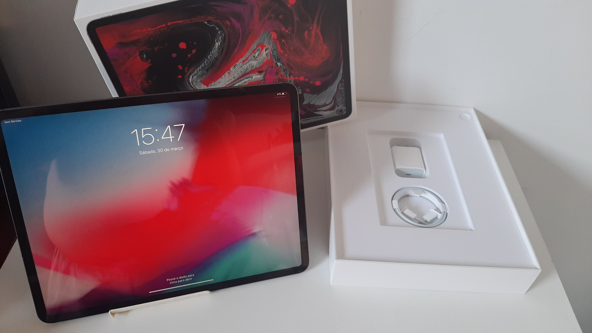
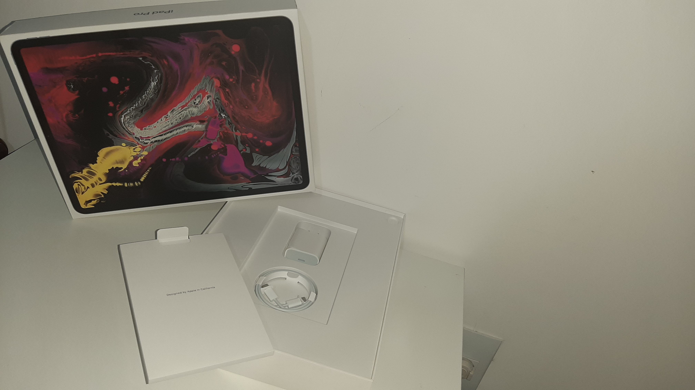
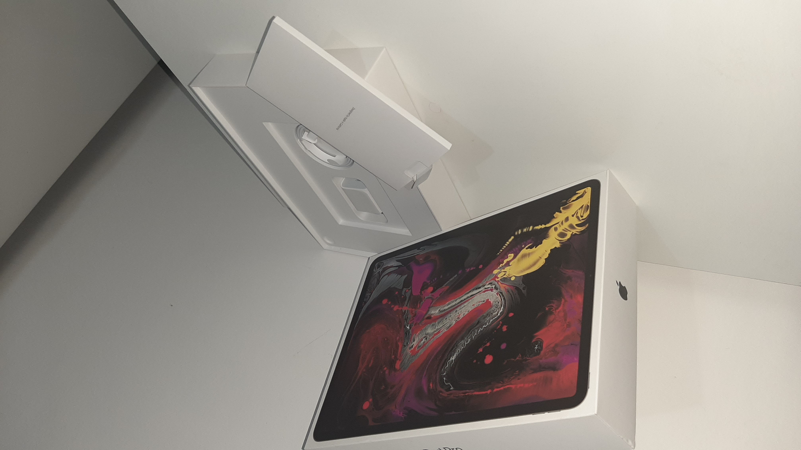
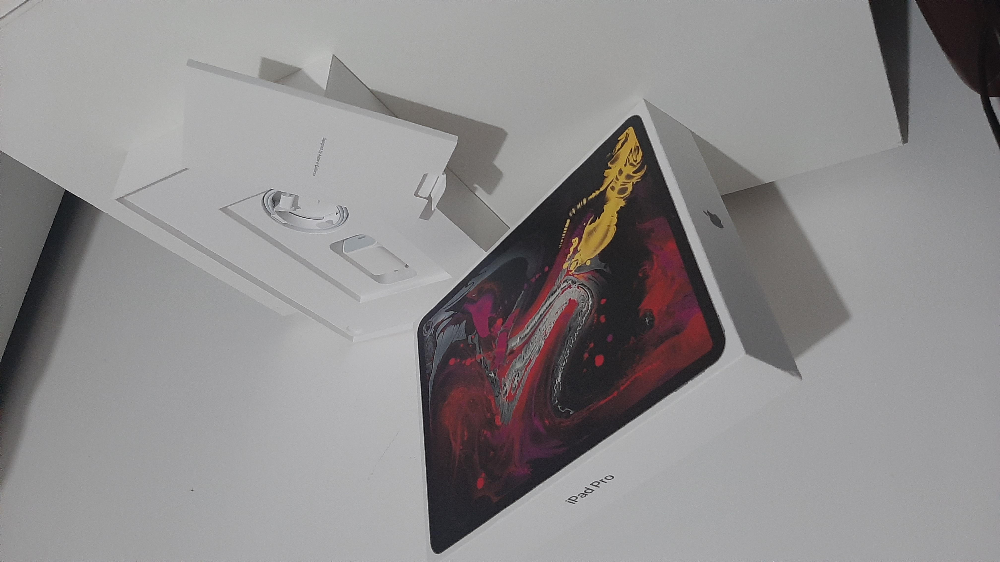
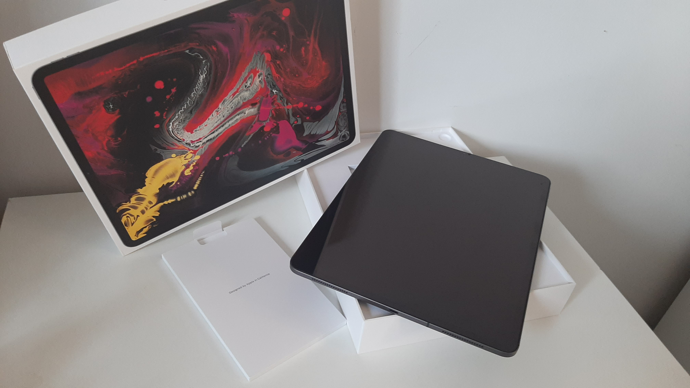
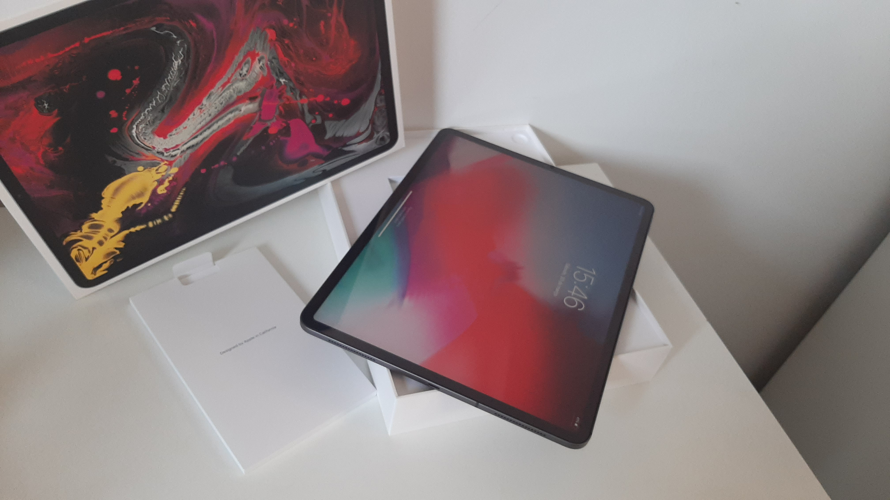
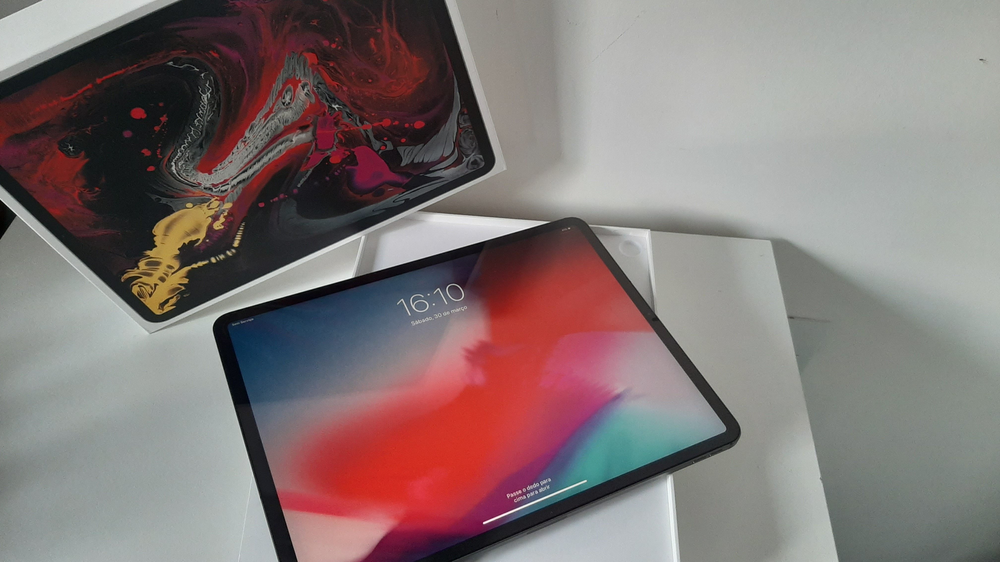
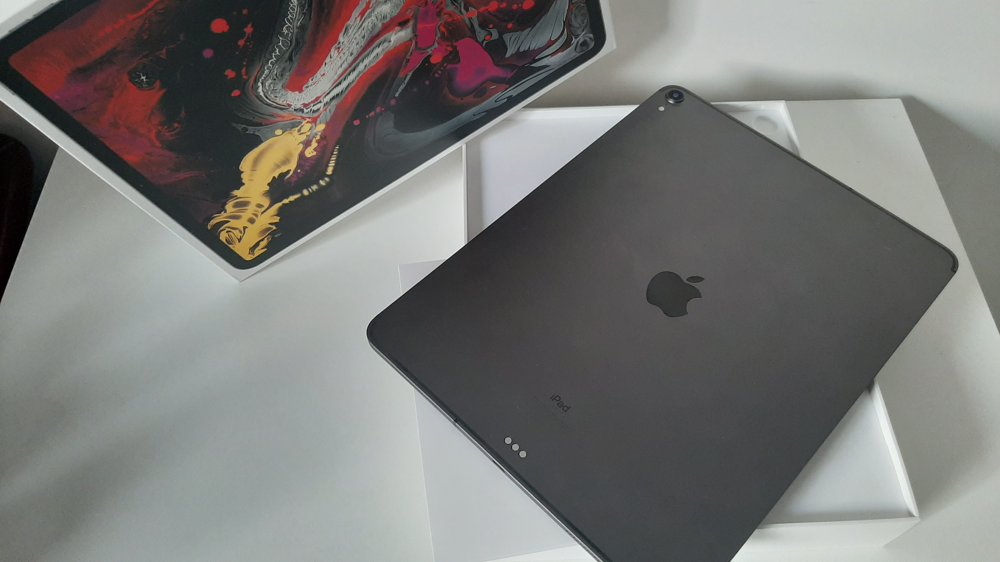

### Ipad Apple Pro 2018 3ª Generação 12.9" 64GB

>
[Voltar ao Catalogo de Produtos](./lista.md)
> 

Produto comprado no Japão no final de 2018 inicio de 2019, aberto para conferencia e para passar pela alfandega sem taxa. Nota Fiscal Original do Japão.

Nunca usado, com película incluida.

Link para compra pelo ML: https://produto.mercadolivre.com.br/MLB-1528747615-ipad-pro-2018-3rd-generation-64gb-_JM

OU

Me mande uma mensagem pelo [Meu Facebook](https://www.facebook.com/bruno.p.longo) que conversamos.

#### Ficha do Produto

***Descrição***

Este produto combina a potência e a capacidade de um computador com a versatilidade e facilidade de uso que somente um iPad pode oferecer. A execução de várias tarefas ao mesmo tempo, como editar documentos enquanto procura informações na Internet ou tirar selfie, será extremamente simples. Como se isso não bastasse, oferece a possibilidade de baixar centenas de aplicativos desde a App Store, criados para pintar, desenhar, ouvir música e muito mais!

***Beleza em cada detalhe***

Esta terceira geração Pro inclui uma impressionante tela Liquid Retina que se extende até os bordas. Suas cores vibrantes e o sistema ProMotion fazem tudo parecer espetacular e responder instantaneamente.

***Segurança e acessibilidade***

Seus dados estarão sempre protegidos graças a seu sistema de autenticação facial “Face ID”, com o qual você poderá desbloquear o dispositivo, mantendo-o na vertical ou na horizontal.

***Tecnologia de excelência***

Seu chip A12X Bionic é o mais poderoso que a Apple criou até agora, pois processa gráficos duas vezes mais rápido que os modelos anteriores, assim, você viverá experiências de realidade aumentada e desfrutará de jogos incríveis ao máximo. Por sua vez, possui Neural Engine, capaz de executar cinco bilhões de operações por segundo e levar o aprendizagem da máquina a outro nível.

#### Características principais
|<!---->|<!---->|
|--|--|
|Marca|Apple|
|Linha|iPad Pro|
|Modelo|3ª Generación|
|Versão|2018|
|Modelo alfanumérico|A2014
|Cor|Chumbo|
|Capacidade|64 GB
|Com conectividade celular|Sim
|Tamanho da tela|12.9 "

|<!---->|<!---->|
|--|--|
|  |  |
|  |  |
|  |  |
|  |  |