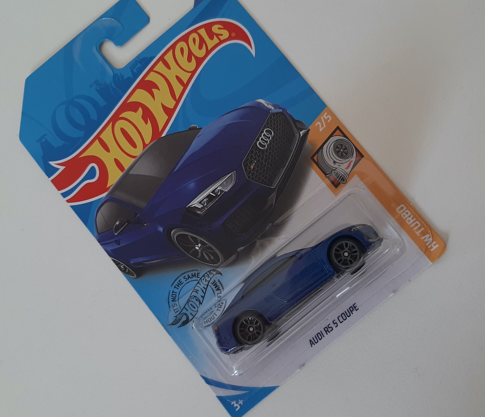
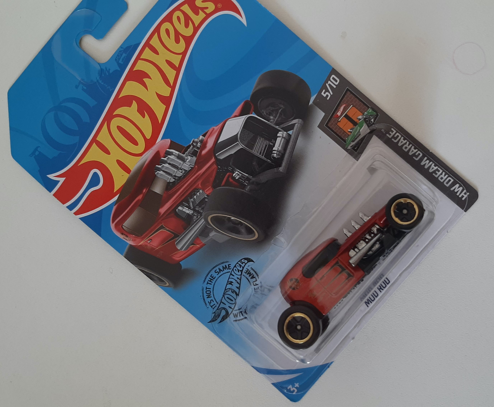
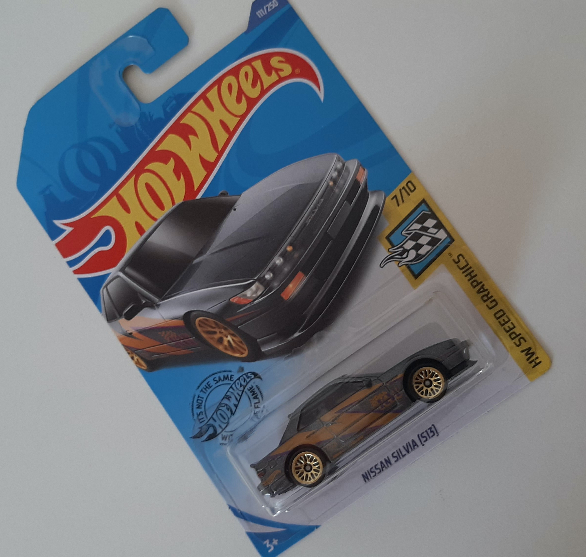

<h2> NWar Imports & Exports</h2>

Bem-vindo(a).

Nwar Imports & Exports foi criado para auxiliar e trazer produtos de coleção de carro 1:64 de qualidade e a preços justos as colecionadores.

Abaixo você contra duas areas, a primeira chamada de Biblioteca, nela você tem informações sobre modelos de carros e as miniaturas insparadas nele. Um base legal de conhecimento para você que gosta de saber mais sobre os veiculos.

Depois existe o Catalogo Nwar, uma lista com todos os veiculos cadastrados a venda em nossa garaegem, assim como informações de compras e link para comprar conosco.

### Biblioteca 

|Imagem|Marca/Modelo|Classificação
|--|--|--|
| |[Mazda RX-7](./pt/mazda-rx7.md) |Importados|
| | |Muscle|
| | |Rod Hots|

### Catalogo NWar Imports & Exports

Devido ao site ser hospedado gratuitamente o sistema de busca dele não pode ser implementado, porem, basta você pressionar CTRL+F (Command+F no Mac OS) e pesquisar a informação que deseja na tabela abaixo. 

A tabela esta classificada por marca, modelo ou nome da miniatura. 

(Possivel que alguns itens tenham também coleção)

### Blister

|Imagem|Descrição/Modelo|Coleção|Código|Preço R$|
|--|--|--|--|--|
 ||[49 Ford F1]()|Rod Squad|GHD27-D7C5|R$15,00| 
 ||[69 Chevelle]()|Tooned|GHF25-D7C5|R$15,00| 
 ||[70 Volkswagen Baja Bug]()|Tooned|GHB57-D7C5|R$15,00| 
 ||[88 Honda CR-X]()|Honda|GHC10-D7C5|R$15,00| 
 ||[95 Mazda RX-7]()|HW Turbo|GHF76-D7C5|R$15,00| 
 ||[Audi RS 5 Coupe]()|HW Turbo|GHD00-D7C5|R$15,00| 
 ||[Batmobile]()|Batman|GLN68-D7C5|R$15,00| 
 ||[Fish'd & Chip'd]()|HW Art Cars|GHC16-D7C5|R$15,00| 
 ||[Honda Monkey Z50]()|Honda|GHF51-D7C5|R$15,00| 
 ||[Land Rover Series III Pickup]()|Baja Blazers|GHG13-D7C5|R$15,00| 
 ||[Mazda RX-7]()|Speed Blur|GHD32-D7C5|R$15,00| 
 ||[Mod Rod]()|HW Dream Garage|GHC24-D7C6|R$15,00| 
 ||[Nissan Silvia (S13)]()|HW Speed Graphics|GHB40-D7C5|R$15,00| 
 ||[Quick Bite]()|HW Art Cars|GHC19-D7C5|R$15,00|  

 ### Packs
|Imagem|Descrição/Modelo|Coleção|Código|Preço R$|
|--|--|--|--|--|

 ### Loose
 |Imagem|Descrição/Modelo|Coleção|Código|Preço R$|
|--|--|--|--|--|