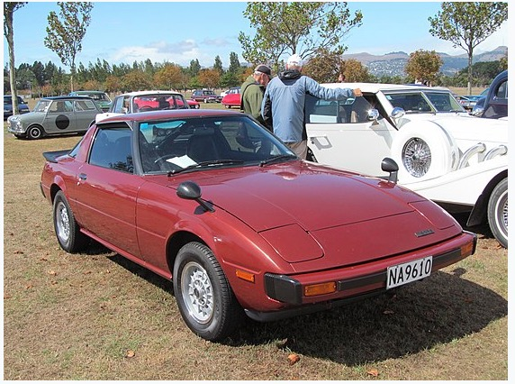

### Historia

Primeiramente lançado em 1978 (Geração 1 - Serie 1) o modelo RX-7 da fabricante Mazda entrou no mercado com um modelo compacto, ele era pequeno e leve e contava com tres versões de motor o [12A](https://en.wikipedia.org/wiki/Mazda_Wankel_engine#12A) (1,146 cc), [12A-Turbo](https://en.wikipedia.org/wiki/Mazda_Wankel_engine#12A) (1,146 cc) e o [13B-RESI](https://en.wikipedia.org/wiki/Mazda_Wankel_engine#13B-RESI) (1,308 cc).

|Imagem|Modelo| Informações Técnicas (EN)
|--|--|--|
| Mazda RX-7 Geração 1 Serie 1| [Link](https://www.automobile-catalog.com/model/mazda/rx-7_1gen.html)

### Hot Wheels Inspirados

Muito famoso por si só o RX-7 teve ainda mais fama entre os modelos criados pela hot wheels após sua aparecição no filme [Velozes e Furiosos](https://pt.wikipedia.org/wiki/The_Fast_and_the_Furious_(franquia)) onde ficou em destaque com um dos protagonistas da serie Dominic Toretto ([Vin Diesel](https://pt.wikipedia.org/wiki/Vin_Diesel))

